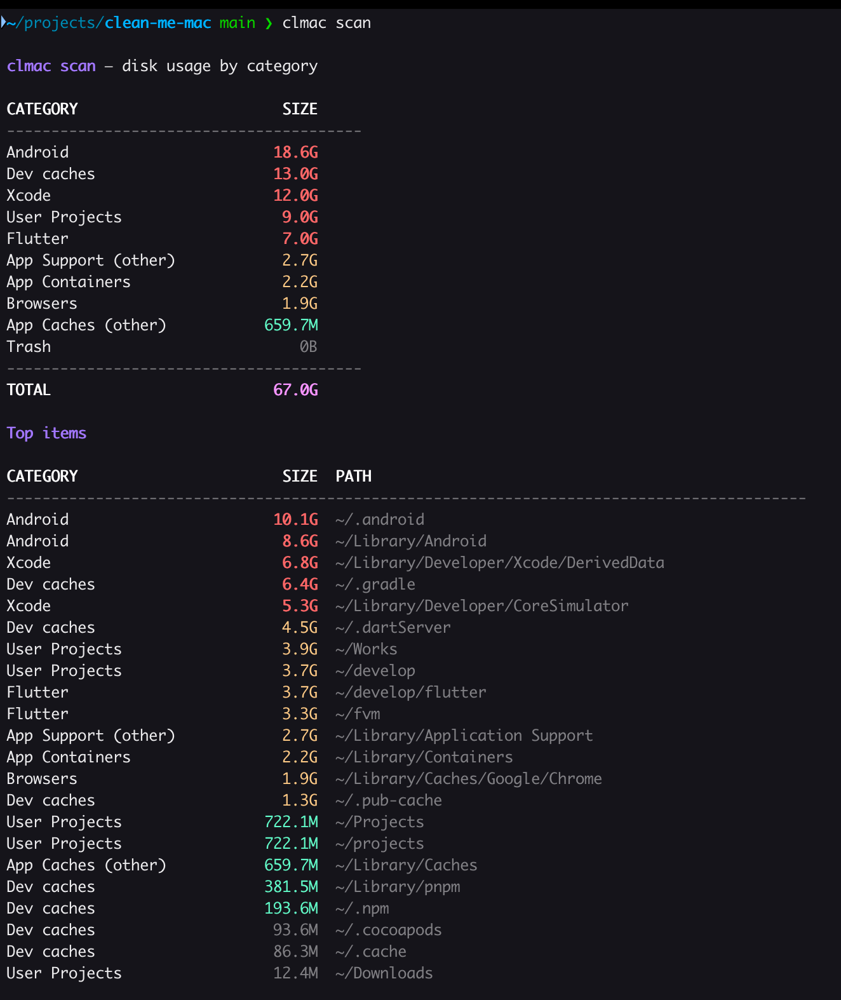
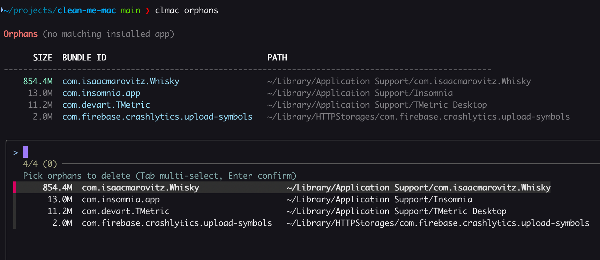
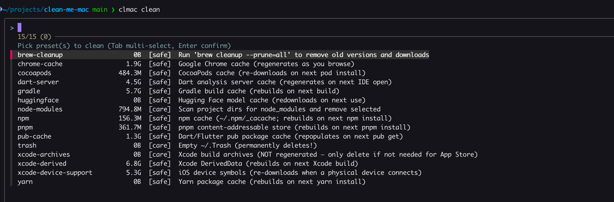

# clean-me-mac (`clmac`)

Focused macOS cleanup CLI. Solves three pains that macOS Storage Settings
doesn't:

1. **What's actually eating my disk?** — categorized scan, not macOS's
   confusing "Documents / System Data" buckets.
2. **Why is app data still here after I uninstalled?** — finds leftover
   Library data with no matching installed app.
3. **What's safe to delete right now?** — curated presets for caches that
   regenerate (`huggingface`, `gradle`, `npm`, `pnpm`, `yarn`, Xcode DerivedData, …).

Pure Bash 5, optional `fzf` for nicer UI, no Go runtime.

---

## Screenshots

### `clmac scan` — categorized disk usage



### `clmac orphans` — find leftover app data



### `clmac clean` — interactive preset picker



---

## Install

```sh
# Requirements
brew install bash jq       # bash 5 + jq required
brew install fzf           # optional but recommended

# Clone and install
git clone https://github.com/bagusmerta/clean-me-mac.git
cd clean-me-mac
./install.sh               # symlinks to /opt/homebrew/bin/clmac
```

## Commands

| Command | What it does |
|---|---|
| `clmac scan` | Categorized disk usage breakdown |
| `clmac orphans` | Find & remove leftover app data |
| `clmac clean [preset]` | Run a known-safe cleanup preset |
| `clmac clean --list` | List all presets with current size |
| `clmac clean --all-safe` | Run every "safe" preset (caches that regenerate) |
| `clmac doctor` | One-screen summary |

### Global flags

- `-n` / `--dry-run` — preview without deleting
- `-y` / `--yes` — skip confirmation prompts
- `--trash` — move to Finder Trash (recoverable) instead of `rm -rf`
- `-v` / `--verbose`
- `--json` — machine-readable output (scan, doctor, orphans)

Every successful delete is appended to `~/Library/Logs/clmac/operations.log`
(tab-separated: timestamp, action, bytes, path), so you can audit what was
removed.

## Presets

| Preset | Safe? | What it cleans |
|---|---|---|
| `huggingface` | ✅ | `~/.cache/huggingface` model weights |
| `gradle` | ✅ | `~/.gradle/caches`, daemon |
| `dart-server` | ✅ | `~/.dartServer` |
| `pub-cache` | ✅ | `~/.pub-cache/hosted`, `~/.pub-cache/git` |
| `npm` | ✅ | `~/.npm/_cacache`, `~/.npm/_logs` |
| `pnpm` | ✅ | `~/Library/pnpm/store`, `~/.pnpm-store` |
| `yarn` | ✅ | `~/.yarn/cache`, `~/Library/Caches/Yarn` |
| `node-modules` | ⚠️ | Interactively pick `node_modules` dirs to remove |
| `cocoapods` | ✅ | CocoaPods cache + repos |
| `xcode-derived` | ✅ | Xcode DerivedData |
| `xcode-archives` | ⚠️ | Xcode build archives — do not delete if needed for App Store |
| `xcode-device-support` | ✅ | iOS device symbols (redownloaded on connect) |
| `android-studio` | ✅ | Android Studio caches & logs across all installed versions |
| `vscode-cache` | ✅ | VS Code caches, logs, GPU/code caches |
| `chrome-cache` | ✅ | Chrome cache directories |
| `safari-cache` | ✅ | Safari + WebKit content cache |
| `firefox-cache` | ✅ | Firefox HTTP & startup cache (all profiles) |
| `brew-cleanup` | ✅ | Runs `brew cleanup --prune=all` |
| `trash` | ⚠️ | Empties `~/.Trash` permanently |

## Orphan detection

Walks these locations and matches each entry against installed app bundle IDs
(read from `Info.plist` of every `.app` in `/Applications`,
`~/Applications`, `/System/Applications`):

- `~/Library/Application Support`
- `~/Library/Caches`
- `~/Library/Containers` (via container metadata plist)
- `~/Library/Preferences`
- `~/Library/Logs`
- `~/Library/Saved Application State`
- `~/Library/HTTPStorages`

Filters out Apple-managed bundle IDs (`com.apple.*`). For folders with
non-bundle-ID names (e.g., `CrossOver`, `Whisky`), uses a built-in mapping
plus a user-extensible list at `~/.config/clmac/known-apps.txt`.

**Format** for `known-apps.txt` (tab-separated):

```
FolderName	com.example.bundleid
```

## Examples

```sh
# What's eating my disk?
clmac scan

# Find orphans, preview only
clmac orphans --dry-run

# Free up the huggingface cache without confirmation
clmac clean huggingface -y

# Wipe everything safe to wipe
clmac clean --all-safe

# One-screen summary
clmac doctor
```

## Layout

```
clean-me-mac/
├── clmac                   entrypoint
├── install.sh              symlinks into /opt/homebrew/bin
├── lib/
│   ├── common.sh           colors, size helpers, confirm, safe_rm
│   ├── ui.sh               select_multi (fzf or numbered fallback)
│   ├── apps.sh             bundle ID resolution
│   ├── scan.sh             cmd_scan
│   ├── orphans.sh          cmd_orphans
│   ├── clean.sh            cmd_clean + preset loader
│   └── doctor.sh           cmd_doctor
└── presets/                one file per preset
```
